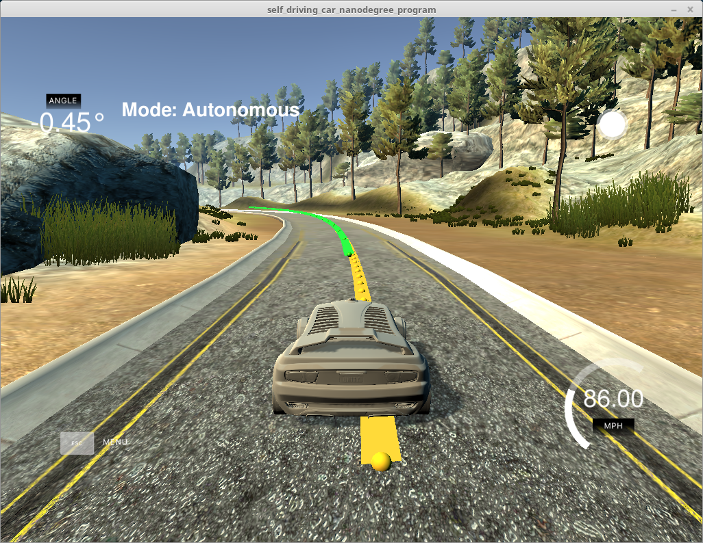
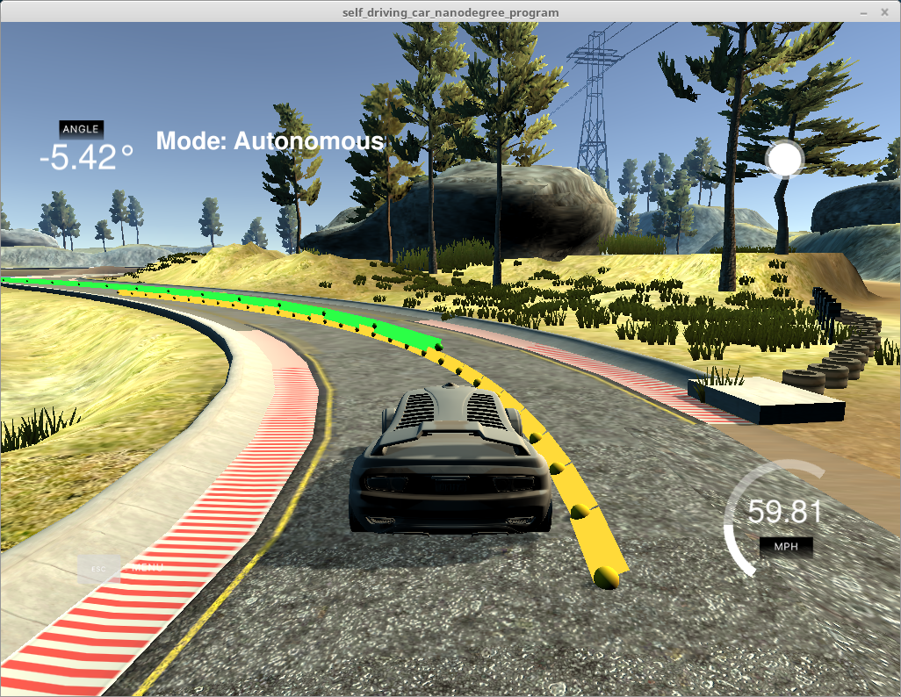
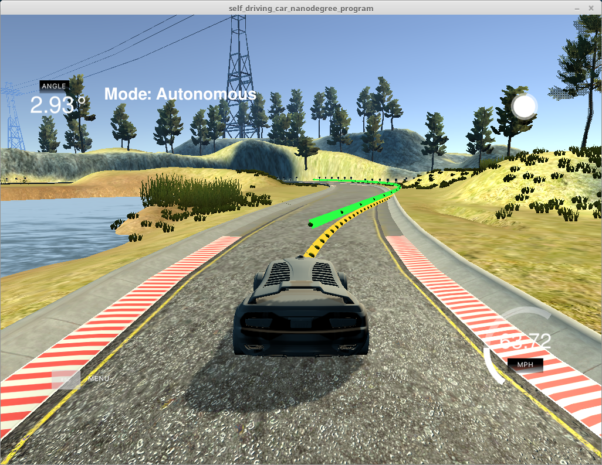
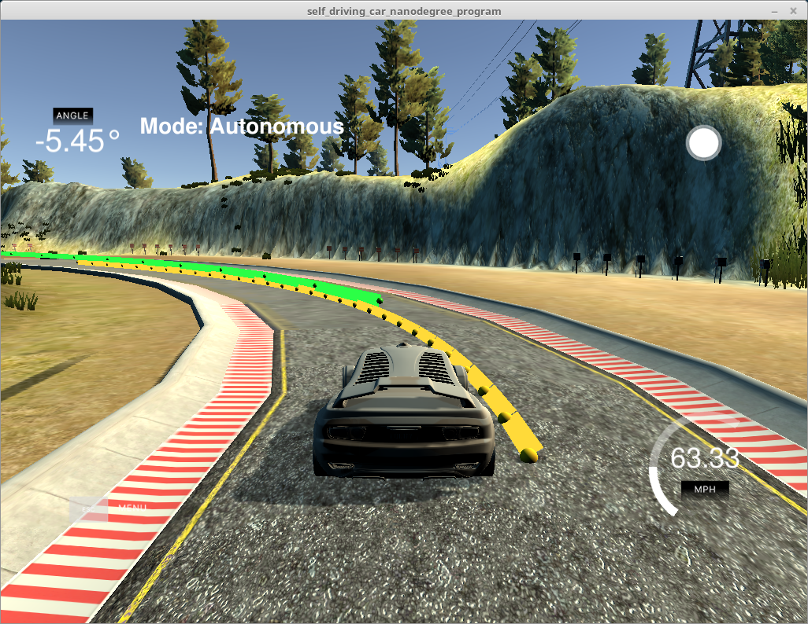

##Motion Predictive Controller Project

###Purpose

The goal of this project was to build a Motion Predictive Controller (MPC).  This controller is an upgrade to the PID controller; it can use knowledge of the path ahead to plan a route.  Using this controller a car can be driven more smoothly at higher speed, as demonstrated on the racetrack simulator.

###Functional Description

A kinematic vehicle model is used.  This model accounts for position, angle, velocity, and basic motion using a bicycle model, but does not include such factors as tire grip, slip angle, etc.  A sophisticated third-party solver is used to apply a sequence of (N-1) actuator inputs, resulting in vehicle motion and creating a path.  The solver attempts to minimize a cost function while meeting constraints that determine the step-by-step state of the solution.  In particular, the constraints model the motion, effectively inducing the equations shown below.  The cost function guides the tradeoffs made:  the solver can use more or less throttle and steering angle at each timestep - should it steer sharper at high speed, follow a smoother line, etc.

I use dt = 100ms and N = 15.  I started out using dt = 50ms and N = 25, and I have used dt up 150ms and N down to 10 successfully.  I find that N > 10 results in higher speed while N > 20 with dt = 100ms results in a very long projected path.  100ms is compatible with the latency in the control loop, and a shorter dt does not appear necessary.  150ms places the next point somewhat far in front of the vehicle and I preferred 100ms.

####Waypoints

The simulator provides a series of landmark points for the vehicle to follow.  A 3rd degree polynomial is fitted to these points and this function forms the goal for the solver used to produce a solution.  Using the current position and the set of equation describing each forward step, the solver decides a set of positions and control inputs forming the path in front of the vehicle.  Only the first control inputs are used since the actual vehicle motion would unfold differently than that predicted.  At each timestep a new path is computed and the process repeats.

####State

* x:  position
* y:  position
* psi:  yaw angle
* v:  velocity
* cte:  cross track error
* epsi: yaw angle error

####Actuators

* delta:  steering angle (radians)
* a:  acceleration

####Equations

* x1 = x0 + v0 * cos(psi0) * dt
* y1 = y0 + v0 * sin(psi0) * dt
* psi1 = psi0 + (v0 / Lf) * delta0 * dt
* v1 = v0 + a0 * dt
* cte1 = f(x0) - y0 + v0 * sin(psi0) * dt
* epsi1 = psi0 - arctan(f'(x0)) + (v / Lf) * delta0 * dt

The first two equations are position, followed by yaw angle, velocity.  The last two are errors:  Cross Track Error, and error in yaw angle. Delta is the steering angle in radians and Lf is the vehicle length from center of gravity (this affects the degree of angular change caused by steering).

Initially, I had tried to compute a more accurate cross track error than assuming simple horizontal motion as in the lecture and Q&A.  Using the approximate method worked far better.  It seemed as though cte and epsi were working against each other and resulting in very slight steering angles.

####Latency

Because real vehicles cannot be controlled instantly, a 100ms delay is built into the control loop.  This delay occurs after telemetry is received and before control outputs are sent.  To account for the latency, the vehicle state is projected out 100ms using the equations above.  Therefore, the solver receives the state of the vehicle as it will be when the next control increment can be applied.  When the solver subsequently projects the path, it does so starting from the position and error resulting not only from the previously reported values but also including motion over the 100ms latency window.

This projection alone did not work acceptably:  the vehicle started oscillating wildly and went off the track.  Oscillations could be damped by weighting the derivative of steering angle delta in the cost function, but I was not able to get this solution above 50MPH.  One way to handle this apparent disconnect is to increase the solver timestep to 150ms, and this worked reasonably well for me.  However, I then considered that the next step of the vehicle actuation will observe 100ms of missing time, so I moved out one 100ms dt in the solver results.  I found ultimately that averaging the first and second solver results, the 0ms and 100ms values, produced a fairly stable result.

###Solver Detail and Issues

The solver relies on a cost function to guide its solution.  I found cost to be a very tricky balancing act.  To the first order the cost should account for requirements such as cte, epsi, speed accuracy, actuator values, and actuator value derivatives for smoothness.  These terms should then be weighted based on relative importance and also relative magnitude.  From there, however, I found it not challenging to get into unstable circumstances in which the solver produces a loop or a bowtie path that can't be explained looking at the target line.

Instead of drawing bowtie paths, and sometimes swerving to certain doom, I am filtering out solutions with very high cost and falling back on previous control values.  When this happens, the green line points are not drawn and a log message indicates the solution was dropped.  This approach assumes a failure due to local minimum, and in fact I observe that the associated results suddenly flip the throttle from near full positive to -1.  The approach is also limited in that the car will crash if multiple sequential failures occur.  So far I have observed only occasional back to back failures and the car has stayed on course.

###Test Results

Using simulator v1.4 I have run multiple laps with a maximum observed speed of 83MPH.  The car remains on the track, although it does touch paint sometimes.  Except in case of a double failure as mentioned above, the car should stay off the concrete shoulders.  With some parameter settings, the car exceeds 100MPH while remaining on the track, but I had more instability issues as described above.

